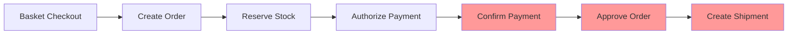

# E-Commerce Checkout Workflow Analysis Report

**Date**: January 31, 2025  
**Customer ID**: c2dafb12-633e-4e79-837e-6030d111b692  
**Basket ID**: 816a0d43-7aed-458e-a0b3-f803caca7cad  
**Order ID**: c07de75c-8cf6-4326-9378-a15b058c09cc  
**Payment Intent**: pi_3RqriSKeQ8snTy810mit18oq  

## Executive Summary

Critical workflow failures were identified in the e-commerce checkout process. While the initial checkout steps execute successfully, the saga workflow **terminates prematurely** after payment authorization, leaving orders in an incomplete state without shipping/fulfillment processing.

## Critical Issues Identified

### 1. 🚨 **Incomplete Saga Execution**

The checkout saga stops after Step 3 and never proceeds to shipping/fulfillment:

| Saga Step | Service | Status | Details |
|-----------|---------|--------|---------|
| Step 1: Create Order | Ordering | ✅ SUCCESS | Order created at 08:20:09.811AM |
| Step 2: Reserve Stock | Products | ✅ SUCCESS | Batch stock reservation completed |
| Step 3: Authorize Payment | Payments | ⚠️ SKIPPED | Payment intent already existed |
| **Step 4: Confirm Payment** | Payments | ❌ MISSING | No logs found |
| **Step 5: Approve Order** | Ordering | ❌ MISSING | No logs found |
| **Step 6: Create Shipment** | Shipping | ❌ MISSING | No activity detected |

**Root Cause**: The saga appears to terminate after skipping payment authorization without continuing to subsequent steps.

### 2. 💰 **Payment Amount Discrepancy**

Significant inconsistency in payment amounts across services:

```
Payments Service: amount: 20199 (cents) = $201.99
Baskets Service:  total: 199 = $1.99 (?)
```

**100x difference** suggests incorrect currency/unit handling between services.

### 3. 🔄 **Double Checkout Prevention Working**

The system correctly prevents double checkout attempts:

```
Error: "the basket cannot be modified"
Status: basket already in "checked_out" state
```

This is expected behavior but creates a poor user experience without proper error messaging.

### 4. 📦 **Shipping Service Isolation**

The shipping service shows **zero activity** for any checkout operations:
- Service is running and healthy
- No incoming events processed
- No saga commands received
- Complete isolation from checkout workflow

### 5. 🔍 **Missing Order Retrieval**

Frontend receives **404 errors** when trying to fetch orders:
```
GET /orders/customer/c2dafb12-633e-4e79-837e-6030d111b692 → 404 Not Found
```

This suggests orders may not be properly indexed by customer ID or the API endpoint is misconfigured.

## Detailed Workflow Analysis

### Successful Flow (Partial)


### Expected Complete Flow



## Service-by-Service Analysis

### Baskets Service
- ✅ Checkout initiation works correctly
- ✅ Publishes BasketCheckedOut event
- ✅ Prevents double checkout
- ❌ Amount calculation may be incorrect

### COSEC (Saga Orchestrator)
- ✅ Receives BasketCheckedOut event
- ✅ Executes Steps 1-3
- ❌ Fails to continue after Step 3
- ❌ Missing Step 4-6 execution logs
- ❌ No error handling for skipped steps

### Ordering Service
- ✅ Creates order successfully
- ✅ Publishes OrderCreated event
- ❌ Never receives ApproveOrder command
- ❌ Order remains in pending state

### Payments Service
- ✅ Handles existing payment intents correctly
- ⚠️ Amount discrepancy with basket total
- ❌ ConfirmPayment step never executed

### Shipping Service
- ✅ Service is running
- ❌ No integration with checkout workflow
- ❌ Never receives CreateShipment commands
- ❌ Complete isolation from saga

## Data Corruption & Missing Events

### Missing Events
1. **PaymentConfirmed** - Never published
2. **OrderApproved** - Never published  
3. **ShipmentCreated** - Never published

### Data State Issues
1. **Order**: Stuck in "pending" state
2. **Payment**: Authorized but not confirmed
3. **Stock**: Reserved but order not fulfilled
4. **Shipment**: Never created

### Potential Data Corruption
1. **Orphaned Stock Reservations**: Stock reserved for orders that never complete
2. **Incomplete Orders**: Orders created but never fulfilled
3. **Payment Holds**: Authorized payments without confirmation

## Root Cause Analysis

The primary issue appears to be in the COSEC saga orchestrator:

1. **Saga Definition Bug**: The saga may not properly handle the case where payment authorization is skipped
2. **Missing Step Transitions**: No logic to proceed from skipped Step 3 to Step 4
3. **Event Handler Gap**: Missing handlers for payment-related events
4. **Service Integration**: Shipping service not properly integrated into saga workflow

## Recommendations

### Immediate Actions
1. **Fix Saga Flow**: Update COSEC to continue to Step 4 when Step 3 is skipped
2. **Add Logging**: Comprehensive logging for all saga step transitions
3. **Fix Amount Handling**: Standardize currency/amount representation across services
4. **Integration Testing**: End-to-end tests for complete checkout flow

### Medium-term Improvements
1. **Saga Monitoring**: Add metrics and alerts for incomplete sagas
2. **Compensation Logic**: Implement proper rollback for failed checkouts
3. **Service Health Checks**: Verify all services are receiving events
4. **Data Consistency**: Add periodic checks for orphaned data

### Long-term Architecture
1. **Saga Visualization**: Real-time saga execution monitoring
2. **Event Sourcing**: Complete audit trail for all checkout attempts
3. **Circuit Breakers**: Prevent cascading failures
4. **Idempotency**: Ensure all operations are safely retryable

## Conclusion

The checkout workflow has a **critical failure** in the saga orchestration that prevents orders from completing. While individual services function correctly in isolation, the integration between them breaks down after payment authorization, leaving the system in an inconsistent state. This requires immediate attention to restore full checkout functionality.

## Appendix: Log Evidence

### Basket Checkout Success
```
"BASKETS_CHECKOUT_SUCCESS: BasketCheckedOut event published - SAGA SHOULD START"
```

### Saga Stops After Step 3
```
"COSEC_SAGA_AUTHORIZE_PAYMENT_SKIP: Payment intent already exists, skipping authorization - PROCEEDING TO STEP 4"
[No further saga logs after this point]
```

### Shipping Service Isolation
```
started shipping service
[No checkout-related activity]
```

### Order Retrieval Failure
```
Frontend: GET /orders/customer/c2dafb12-633e-4e79-837e-6030d111b692 → 404 Not Found
```